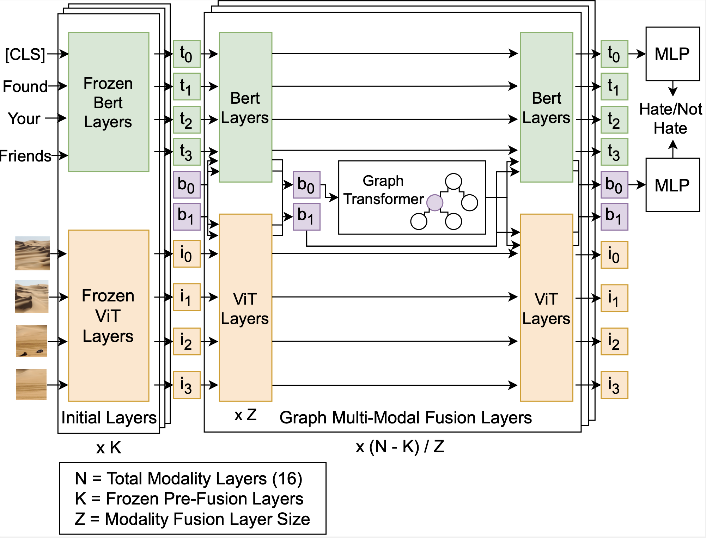

# Multi Modal Discussion Transformer: Integrating Text, Images and Graph Transformers to Detect Hate Speech on Social Media (AAAI 2024)
<h1 align="center">
 
</h1>

**Abstract**: We present the Multi-Modal Discussion Transformer (mDT), a novel method for detecting hate speech on online social networks such as Reddit discussions. In contrast to traditional comment-only methods, our approach to labelling a comment as hate speech involves a holistic analysis of text and images grounded in the discussion context. This is done by leveraging graph transformers to capture the contextual relationships in the discussion surrounding a comment and grounding the interwoven fusion layers that combine text and image embeddings instead of processing modalities separately. To evaluate our work, we present a new dataset, HatefulDiscussions, comprising complete multi-modal discussions from multiple online communities on Reddit. We compare the performance of our model to baselines that only process individual comments and conduct extensive ablation studies. ([Paper](https://arxiv.org/abs/2307.09312))

This repository contains the source code for the mDT Architecture, code to evaluate text-only baselines and how to create the HatefulDiscussions dataset. Our code base is based on the [Graphormer](https://github.com/microsoft/Graphormer) and FairSeq repositories, with many modifications. This repository is also intended to be a living repository for ongoing follow-up work based on this research (mDT-Experimental). Links will be provided shortly to download the HatefulDiscussions dataset directly. Please "follow" and "star" this repository to receive updates when it is released. 

## Organization
The code base is organized into three sections:
- **Pre-Processing** contains the code to create the HatefulDiscussions dataset from scratch.
- **Comment Only Experiments** contains the code to process the hateful discussions dataset and evaluate individual comment-only baselines
- **mDT** contains the source code for the Multi-Modal Discussion Transformer

mDT is organized as follows:

- **Experiments**: Contains folders for each dataset using this architecture, including launch scripts and data loading. Currently, this includes HatefulDiscussions, as well as WIP future work in a private nested submodule. Future work on other datasets should extend this folder
- **src/criterions**: Contains and registers each loss function which can be used
- **src/data**: Contains data loading utilities to collate and batch data into training examples.
- **src/models**: Contains model configurations and hyper-parameters. Model configurations registered are used in the launch script
- **src/modules**: Contains multi-purpose modules that makeup models. These modules contain the actual model logic.
- **src/tasks**: Contains logic for building data loaders in `src/data` and loading pre-trained checkpoints. Tasks requiring advanced logic for loading pre-trained checkpoints should extend these files.
